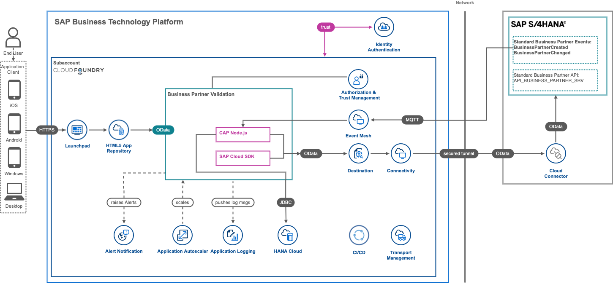

# Extend SAP S/4HANA Business Processes on SAP BTP by Leveraging DevOps

## Business Scenario

A business scenario is used to showcase how to build a S/4 HANA on premise extension Application on SAP BTP.

John who is an employee of Business Partner Validation Firm iCredible, which is a third-party vendor of ACME Corporation would like to get notifications whenever new Business Partners are added in the S/4HANA backend system of ACME Corporation. John would then be able to review the Business Partner details in his extension app. He would proceed to visit the Business Partner’s registered office and do some background verification. John would then proceed to update/validate the verification details into the extension app. Once the details are verified, the Business Partner gets activated in the S/4HANA system of ACME Corporation.

- Custom extension application that works independently from S/4HANA.

- Changes in S/4 communicated via events in real time to extension application.

- Vendor personnel needs access to only custom app

### Solution Diagram

The Business Partner Validation application is developed using the SAP Cloud Application programming Model (CAP) and runs on the SAP BTP, Cloud Foundry runtime. It consumes platform services like SAP Event Mesh, SAP HANA Cloud and the Connectivity service. The events occuring in S/4 HANA on premise are inserted into the SAP Event Mesh queue. The application running in Cloud Foundry is notified on events, consumes them from the queue and inserts the event data into the HANA database. The Business Partner Validation Application uses S/4 HANA OData API's to read additional Business Partner Data from the S/4 HANA system. In case of updates performed by the third-party vendor the SAP Cloud SDK is used to update the corresponding data in the S/4HANA on premise system. 

## Requirements
The required systems and components are:

- SAP S/4HANA on premise system.
- SAP BTP account

Entitlements/Quota required in your SAP Business Technology Platform Account:

| Service                            | Plan        | Number of instances |
| ---------------------------------- | ----------- | ------------------- |
| Connectivity                       | lite        | 1                   |
| Destination                        | lite        | 1                   |
| HTML5 Application Repository       | app-host    | 1                   |
| Event Mesh                         | default     | 1                   |
| Application Logging                | lite        | 1                   |
| Authorization & Trust Management   | application | 1                   |
| SAP HANA Schemas & HDI Containers  | hdi-shared  | 1                   |
| SAP HANA Cloud                     |             |                     |
| Cloud Foundry runtime              |             |                     |
| Application Autoscaler             | standard    | 1                   |
| [Optional] SAP Private Link (BETA) | standard    | 1                   |

Subscriptions required in your SAP Business Technology Platform Account:

| Subscription                      | Plan             |
| --------------------------------- | ---------------- |
| SAP Business Application Studio   | standard         |
| Event Mesh                        | standard         |
| Launchpad Service                 | standard         |
| Continuous Integration & Delivery | default          |
| Cloud Transport Management        | saas-application |

## Setup & Configuration

### Step 1: [Identify APIs in API Business Hub](./tutorials/01-IdentifyAPIFromAPIBusinessHub.md)
### Step 2: [S/4HANA Enable OData Service for business partner](./tutorials/02-configure-oData-Service)

> Either follow Step 3a or 3b (not both) depending on whether you use an SAP BTP trial account or an SAP BTP enterprise account
### Step 3a: [Setup SAP BTP Enterprise Environment](./tutorials/03-PrepareBTP)
### Step 3b: [Setup SAP BTP Trial Environment](./tutorials/03-PrepareBTPTrial)
### Step 4: [Create SAP HANA Cloud instance](./tutorials/04-SetupHANACloud)

There are two Options to establish connectivity between S/4HANA system and SAP BTP:
   * First one (see Step 5a) is the well know connectivity via **SAP Cloud Connector**
  
   * Second option (see Step 5b) is through new **SAP Private Link (BETA)** Service. In this way Cloud Foundry applications running on SAP BTP with Microsoft Azure as IaaS provider can communicate with Azure Private Link services via a private connection. This ensures that traffic is not routed through the public internet but stays within the Azure infrastructure.
  
   >Note: Currently, we only support the connection from SAP BTP Cloud Foundry to Azure Private Link services. 

   >Note, For the beta release, you can connect to Microsoft Azure Private Link Service running behind the Azure Standard Load Balancer.
 
Please continue either with Step 5a or 5b based on your scenario/requirement  
### Step 5a: [Setup connectivity between S/4HANA system, SAP BTP - SAP Cloud Connector](./tutorials/05-CloudConnector)

### Step 5b: [Setup connectivity between S/4HANA system, SAP BTP - SAP Private Link (BETA)](./tutorials/05-PrivateLink)

### Step 6: [Configure Business Application Studio and Build/Deploy the CAP application ](./tutorials/06-ConfigureCAPApp)
### Step 7: [Configure Event Based Communication between S/4HANA and Event Mesh](./tutorials/07-SetupEventMesh)
### Step 8: [Test scenario End to End](./tutorials/08-TestApplication)
### Step 9: [Access and Discover Application Logs and Metrics](./tutorials/09-ApplicationLogging)
### Step 10: [Setup of Continuous Integration and Continuous Delivery (CI/CD) ](./tutorials/10-SetupCICD)
### Step 11: [Setup Cloud Transport Management ](./tutorials/11-SetupTMS)
### Step 12: [Setup Alert Notification ](./tutorials/12-SetupANS)
### Step 13 (optional): [Setup Application Autoscaler ](./tutorials/13-SetupAppAutoscaler)

## How to obtain support

[Create an issue](https://github.com/SAP-samples/<repository-name>/issues) in this repository if you find a bug or have questions about the content.
 
For additional support, [ask a question in SAP Community](https://answers.sap.com/questions/ask.html).

## Contributing

## License
Copyright (c) 2021 SAP SE or an SAP affiliate company. All rights reserved. This project is licensed under the Apache Software License, version 2.0 except as noted otherwise in the [LICENSE](LICENSES/Apache-2.0.txt) file.
