# SAP S/4HANA Extension over SAP Private Link (BETA) service to Azure

In this section you can find all required steps for your Extension Application to use SAP Private Link Service to consume OData resources from S/4HANA system located on **Azure** subscription. 
More details about [SAP Private Link Service ](https://blogs.sap.com/2021/06/28/sap-private-link-service-beta-is-available/).

In our use case we are going to use the SAP Private Link service to communicate with an SAP S/4HANA system (or other SAP or non-SAP system running on a VM in your own Azure account) privately from within SAP BTP Cloud Foundry without SAP Cloud Connector.

Having SAP Private Link will not require anymore to expose the systems and communication through internet and the whole traffic is secured by internal hyperscaler network without any exposure. 

Current use case is describing an SAP S/4HANA extension, of course having a S/4HANA solution deployed on Azure.

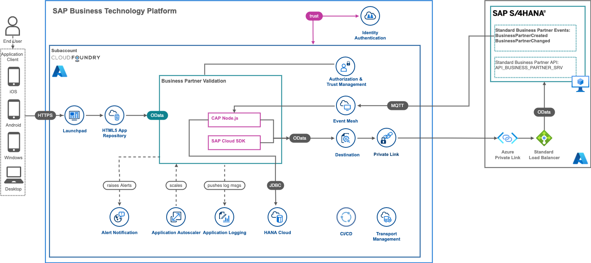

## Architecture Description
With SAP Private Link service, Cloud Foundry applications running on SAP BTP with Microsoft Azure as IaaS provider  can communicate with Azure Private Link services via a private connection. 
This ensures that traffic is not routed through the public internet but stays within the Azure infrastructure.


This connection can be established by creating an Azure Private Link service that exposes a load balancer which routes traffic to the SAP S/4HANA system. This Azure Private Link service must then be used as the resource to which the SAP Private Link service connects to. As soon as the connection is established successfully, the SAP Private Link service provides private DNS hostnames pointing to the Azure Private Link service.

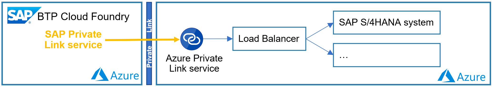

## Set Up SAP Private Link Service on BTP

The Enhanced BETA version of Private link service is available on BTP accounts running on Azure and should be enabled under your BTP subaccount.

To be able to use the functionalities of SAP Private Link service, you first need to set the entitlements in your subaccount.
On <code>SAP BTP Cockpit -> Entitlements</code>, the <code>Private Link Service</code> should be configured.

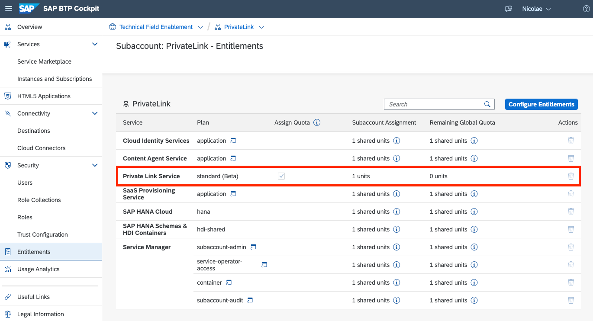


## Azure Private Link Service

Azure Private Link Service can be created only by using a Azure Load Balancer. 

**Very Important**:  [Azure Private Link Service is only supported on Standard Load Balancer.](https://docs.microsoft.com/en-gb/azure/private-link/private-link-service-overview#properties)

### Creation of Azure Load Balancer

As reference see bellow, where all properties should be yours, the only two properties have to remain unchanged:
- Type: Internal
- SKU: Standard

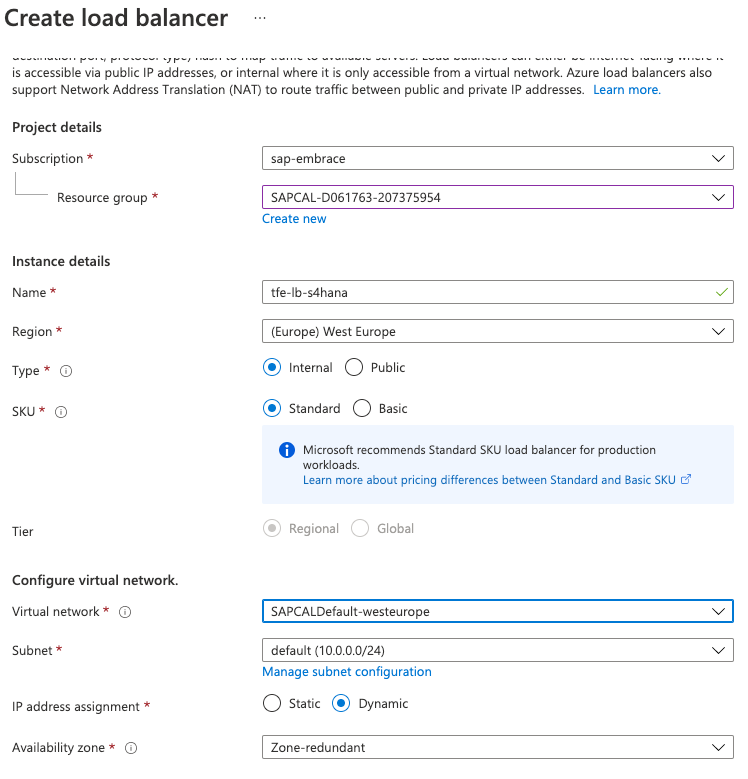

Once created, navigate to it, under the <code>Settings -> Health probes</code>, health probes records should be added 
by clicking the <code>+ Add</code> button.


For S/4HANA VM as health probe will serve port 22.

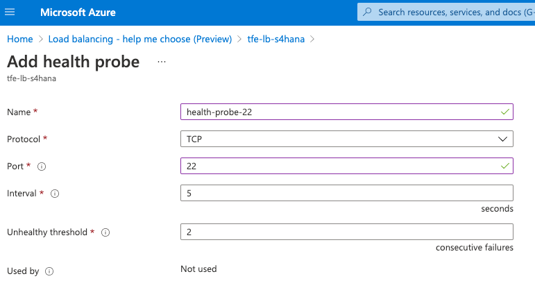

Now is time to add Virtual Machines which will serve the load coming to current load balancer.

Under the created load balancer, navigate to <code>Settings -> Backend pools</code>, a pools of virtual machines should be added
by clicking the <code>+ Add</code> button. 


**Very Important**:  If Virtual Machine which is supposed to be added into the pool do have associated a Public IP,
then the Public IP should have the Standard SKU. Usually VMs created using CAL do have Public IP on Basic SKU, 
so manually should be changed to Standard. 

Make sure that a pool has been created and Virtual Machine has been added.

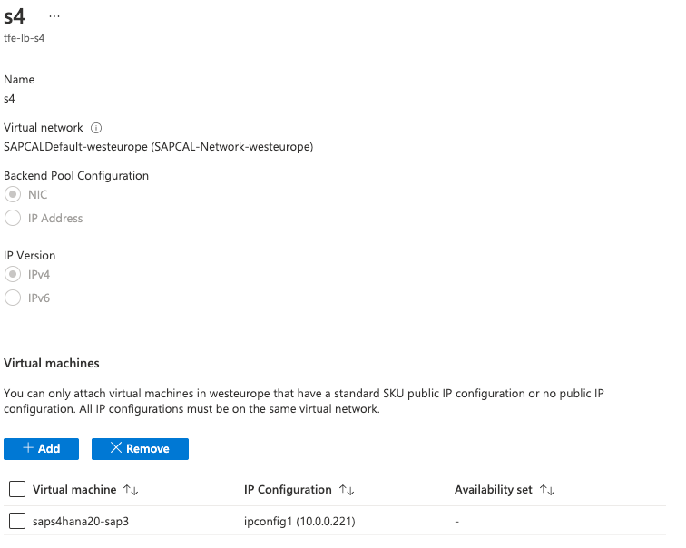

Under the <code>Settings -> Load balancing rules</code>, records should be added
by clicking the <code>+ Add</code> button. Two rules should be created having port and backend port 50000 & 44300 
using early create pool and health probe, as reference:

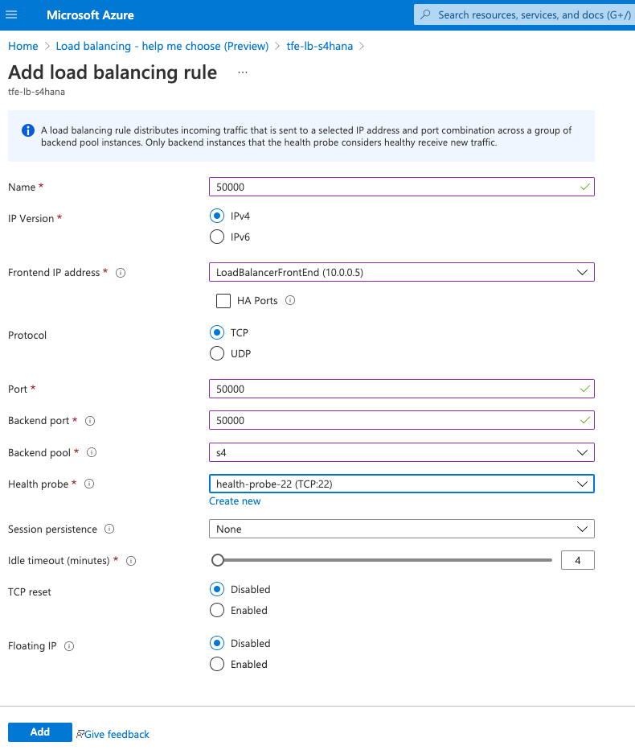

After the status can be checked navigating <code>Monitoring ->Insights</code>, green status required.

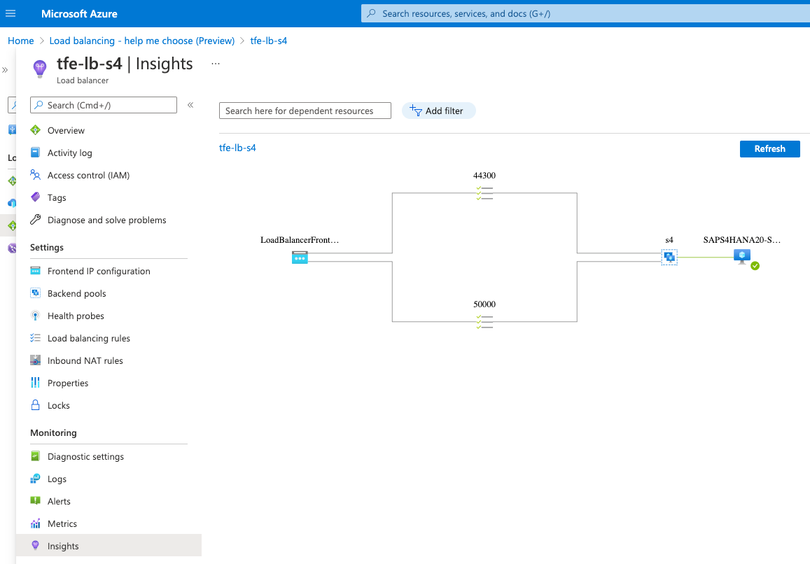

### Creation of Azure Private Link Service

A private link service required in order to have a private link as endpoint. 

Navigate to <code>Private Link Center -> Private link services</code> and add new one by clicking the <code>+ Add</code> button. 


Specifying Basics information:

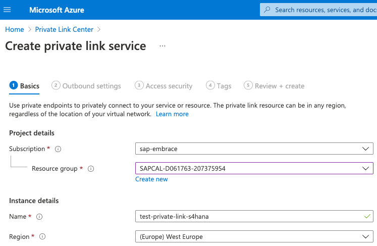

Specifying Outbound information, by selecting early created load balancer:

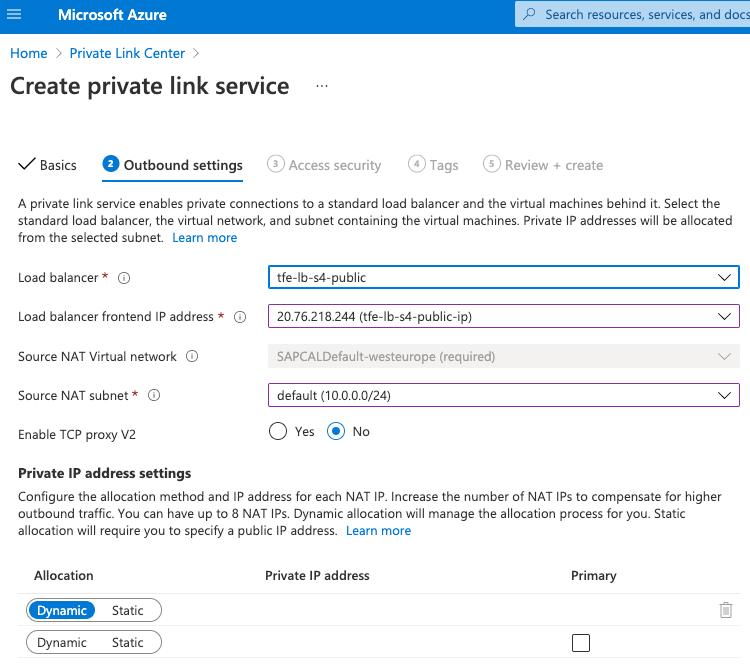

**Very Important**:  Enable TCP V2 option should be on "No". 

At the end of wizard click on <code>Create</code> button.

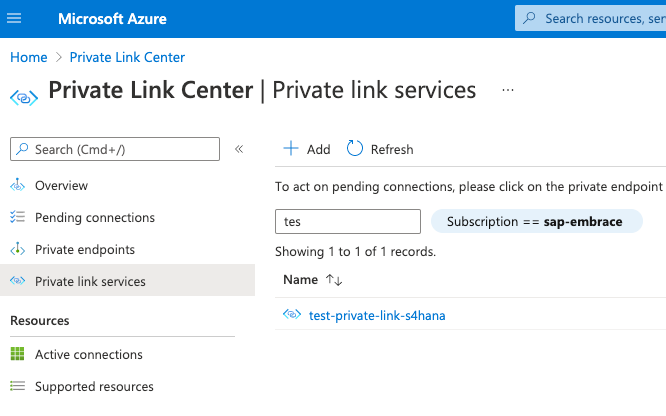

Once create the private link service click on it and look for <code>JSON View</code> link and click on it.


Collect the resource id.

## Create the SAP Private Link Instance

Having the Private Link Service created on Azure and collected the Resource ID, 
ready to start the creation of private link instance on BTP.

Navigate to BTP Cockpit, select the sub account, under the <code>Instances and Subscriptions</code>, 
click <code>Create</code> button.


Select from list of service the <code>Private Link Service</code> and give a name to instance.


Click the <code>Next ></code> button.

You will find a form where "resourceId" field should have as value collected from Azure created Private Link Service Resource ID. 
Moreover you can enter "Request Message" which is displayed to the approver on Azure side.

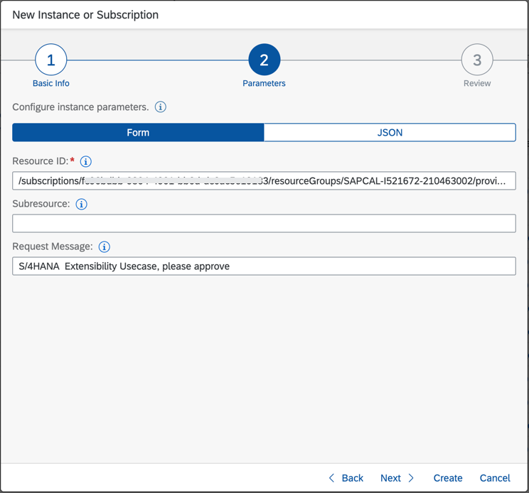

Click the <code>Create</code> button.

New instance of private link creation with status <code>Creation in Progress</code> will come up on BTP instances list.


In order to change the status to <code>Created</code>, an operation on Azure portal is required.

Navigate to Azure Portal on <code>Private Link Center -> Pending connections</code>,
and a waiting connection to be approved, if no records wait by clicking refresh button. 

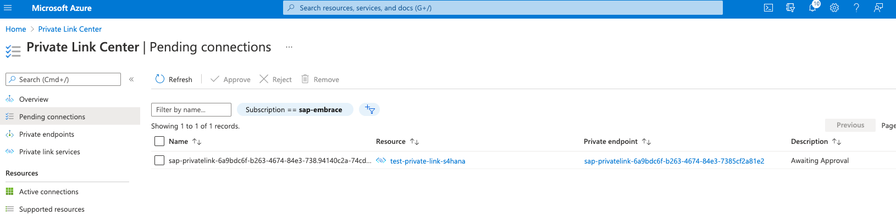

Once pending connection displayed, select it and click the <code>Approve</code> and <code>Yes</code> buttons. 
After some time the record will go away as approved.

Go back to SAP BTP Cockpit, and the private link instance should have green <code>Created</code> status.


After successfull creation you can select the created instance and view created credentials. You can find there the generated set of private DNS hostnames which will be used in upcomming steps for the private communitcaion. 


 >   Although Private Link Service is a private tunnel, it is a common to use Transport Layer Security (TLS) for security between applications. Private DNS hostname will allow issuing certificates based on an actual hostname for the connected resource and enables TLS connections with verified hostnames.


## Prepare Extension Application based on CAP (SAP Cloud Application Programming Model) for PrivateLink communication

There are couple of steps required to enable the Private Link connection in CAP Application. 


### Adapt Destination for PrivateLink Service - Configure the "BusinessPartner" destination

 * Open your SAP BTP Account and navigate to your Subaccount
 * Choose Connectivity in the menu on the left then choose Destinations
 * Modify existing "BusinessPartner" or create new destination and enter the following information to the Destination Configuration:

 Instead of using Proxy Type On-Premise for Cloud Connector connectivity, SAP introduced new Proxy Type  **PrivateLink**. Choose that proxy type and enter Private Link hostname from previous step. 

 Finally add **TrustAll=true** in Additional Properites **(We will change this property in later steps)**.

 > Note: If TrustAll is set to TRUE in the destination, the server certificate will not be checked for SSL connections. It is intended for test scenarios only, and should not be used in production (the server certificate will not be checked and you will not notice MITM attacks). 

An Example of Destination Configuration you can find below. 

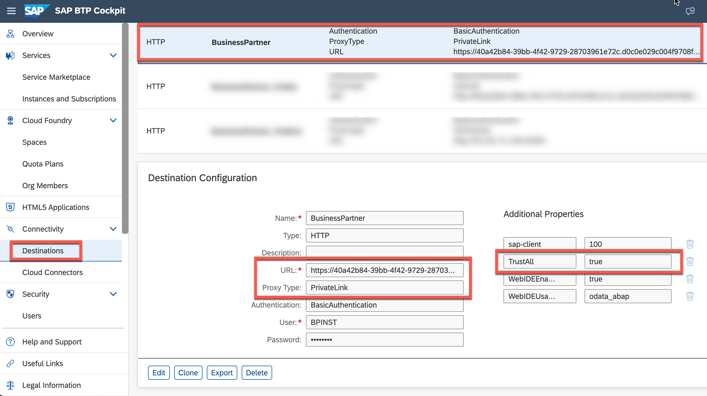

### Destination config
Property | Value |
--- | --- |
Name | BusinessPartner |
Tyoe | HTTP |
URL | https://40a42b84-39bb-xxx-9729-287xxxxe72c.d0c0e029c004f9xxxx8eda0225a83xxxxxxaae23ff65b.p6.pls.sap.internal (replace with your PrivateLink hostname) |
Proxy Type | PrivateLink |
Authentication | BasicAuthentication |
User | <<  username >> |
Password | <<  password >> |

### Additional Properties
Property | Value |
--- | --- |
sap-client | 400 (or the client you want to connect to) |
TrustAll | true  (should not be used in production) |
HTML5.DynamicDestination | true |
WebIDEEnabled | true |
WebIDEUsage | odata_abap |

>Note: Not all SDK/Libraries are suppoprting the ProxyType: PrivateLink yet. For those cases use proxy type Internet instead.


### Bind application to Private Link service

Open the MTA deployment descriptor and add following PrivateLink resource to your MTA and assign it to *BusinessPartnerVerification-srv*

```json

modules:
  - name: BusinessPartnerVerification-srv
    type: nodejs
    path: gen/srv
    requires:
      - name: BusinessPartnerVerification-pl
      - ...

...

resources:
  # PrivateLink Service
  - name: BusinessPartnerVerification-pl
    type: org.cloudfoundry.existing-service
    parameters:
      service: privatelink 
      service-name: private-link-s4hana # change to your instance name
      service-plan: standard

```

### Redeploy the Application and Test it

Build the Multi-Target Application Archive (MTA Archive) by executing the following command in the root directory of your project in the terminal:

  ```
  mbt build -e trial.mtaext
  ```

This will produce a .mtar file in the mta_archives directory. Some of the values for the service instance creation depend on the environment you are deploying to, that's why the *-e* for *extension* is used here. 

Deploy the application to SAP BTP, Cloud Foundry Runtime by executing the following command in the root directory of your project in the terminal:

  ```
  cf deploy mta_archives/BusinessPartnerVerification_1.2.0.mtar
  ```

This will trigger the deployment to SAP BTP, Cloud Foundry Runtime including the creation of the necessary service instances and service bindings to the corresponding services like PrivateLink. 

Try the application by creating new or modifiying Business Partners as described [here](https://github.com/SAP-samples/s4hana-btp-extension-devops/tree/mission/08-TestApplication#test-basic-scenario-end-to-end).


## Setup end-to-end SSL

Instead of igonoring the server certificates by property TrustALL, for **Productive** scenarios we can upload the server certificate of the HTTPS server (in this case S/4HANA) in Trust Store of Destination Service.

coming soon :) 